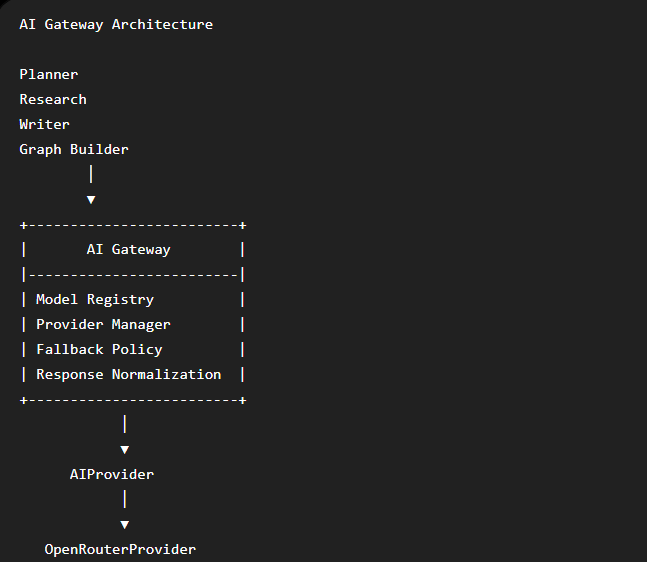

## Phase 7 – AI Gateway



The AI Gateway introduces a provider-independent service boundary for all LLM interactions.

Previously, runtime agents directly communicated with OpenRouter.

```
Planner
Research
Writer
Graph Builder
        │
        ▼
    OpenRouter
```

After Phase 7, every AI-capable component communicates only with the AI Gateway.

```
Planner
Research
Writer
Graph Builder
        │
        ▼
+-------------------------+
|       AI Gateway        |
|-------------------------|
| Model Registry          |
| Provider Manager        |
| Fallback Policy         |
| Response Normalization  |
+-------------------------+
            │
            ▼
      AIProvider
            │
            ▼
   OpenRouterProvider
```

### Responsibilities

- Provider abstraction through a common `AIProvider` interface.
- Role-based model selection using a centralized Model Registry.
- Gateway-managed model fallback.
- Unified `AIResponse` contract across providers.
- Extensible architecture for future providers such as OpenAI or Gemini.